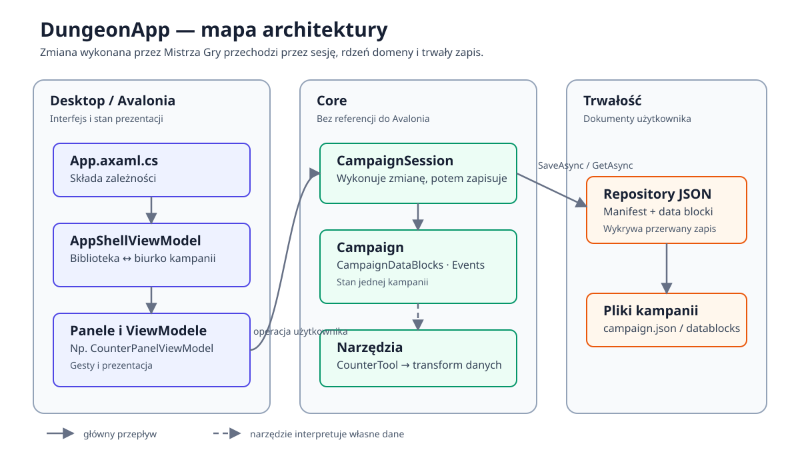

# DungeonApp

Desktopowy panel Mistrza Gry: utrzymuje spójny stan kampanii i prowadzi
księgowość reguł, nie odbierając sesji jej stołowego charakteru. Nie jest
stołem wirtualnym ani grą dla graczy.

C#/.NET 10, Avalonia. Jedna maszyna, jeden użytkownik, bez warstwy
sieciowej.

## Uruchomienie

```bash
dotnet run --project src/DungeonApp.Desktop
```

## Build i testy

```bash
dotnet build DungeonApp.sln
dotnet test tests/DungeonApp.Core.Tests/DungeonApp.Core.Tests.csproj
dotnet test tests/DungeonApp.Desktop.Tests/DungeonApp.Desktop.Tests.csproj
```

## Struktura

```text
src/
  DungeonApp.Core/      # Kampanie, moduły, dziennik, zapis. Bez Avalonia.
  DungeonApp.Desktop/   # Aplikacja Avalonia — shell, biurko, panele, motyw.
tests/
  DungeonApp.Core.Tests/
  DungeonApp.Desktop.Tests/
docs/
```

Podział na dwa projekty produkcyjne jest zabiegiem higienicznym: logika ma
być odseparowana od okna. Granicy pilnuje test architektoniczny, który
odrzuca każdą referencję do Avalonii w `Core`.



## Jak czytać projekt

1. Zacznij od `src/DungeonApp.Desktop/App.axaml.cs`: tam aplikacja składa
   wszystkie zależności.
2. Następnie przeczytaj `Shell/AppShellViewModel.cs`, który przełącza między
   biblioteką kampanii a biurkiem otwartej kampanii.
3. Rdzeń domeny jest w `DungeonApp.Core`: `Campaign`, `CampaignDataBlocks` i
   `JsonCampaignRepository` opisują stan, jego zmianę i trwały zapis.
4. Prześledź licznik jako kompletny przykład narzędzia: `CounterTool` →
   `CounterPanelViewModel` → `CampaignSession` → `JsonCampaignRepository`.

Diagram powyżej pokazuje granice odpowiedzialności i główny przepływ zmiany.
Testy w `tests/` są zarazem wykonywalną specyfikacją tych zachowań.
